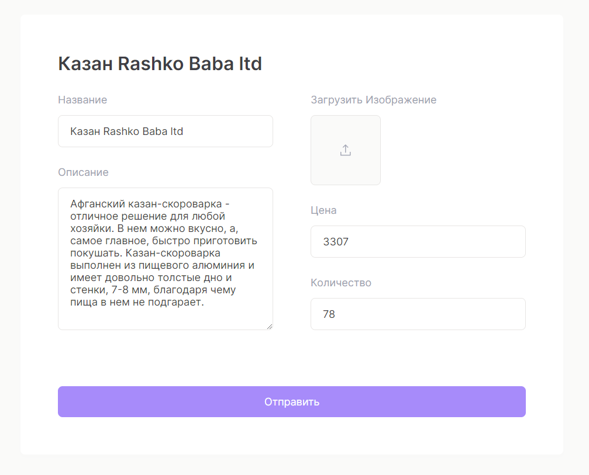

# PERN Marketplace Analytics
MVP of an analytics dashboard made for online fulfillment and easy marketplace integration.

## Demo
Deployed on Heroku — [cortexplace](https://cortexplace.herokuapp.com)

##  General info
The PERN stack: [PostgresSQL](https://www.postgresql.org/), [Express](https://expressjs.com/), [React](https://reactjs.org/) and [Node](https://nodejs.org/en/)

 - [Recharts](https://recharts.org/en-US/)  - charting library built on React components
 - [Moment](https://momentjs.com/)  - library for formatting dates
 - [React Hook Form](https://react-hook-form.com/ ) - library that helps validate forms in React
 - [Toastify](https://www.npmjs.com/package/react-toastify) - allows you to add notifications to your app
 - [JWT](https://jwt.io/)  - a standard to secure/authenticate HTTP requests
 
 ## Features
 - CDUD Application
 - Authentication using jsonwebtoken
 - Token middleware 
 - Form validation
 - Toast notifications
 - All data stored in PostgreSQL database
 - Dynamic search
 - Fully responsive
 - Data visualization (Bar and Area charts)

 ## Overview
  ---
 #### Backend
 The API for now, is deployed at Heroku. Interact with the API using the following endpoint example:
 ```javascript
// get product
app.get ('/products/:id', async (req, res) => {
	try {
		const { id } =  req.params;
		const  getProduct  =  await  pool.query("SELECT * FROM products WHERE id = $1", [id]);
		res.json(getProduct.rows[0]);
	} catch (err) {
	console.error(err.message);
	}
});
```
Response:
```JSON
{
	"id": 6,
	"name": "Фитнес-браслет Mi Band 6",
	"price": 2563,
	"quantity": 16,
	"description": "Умный браслет с новым большим сенсорным AMOLED дисплеем, функцией вибрации для уведомлений, входящих вызовов и будильника для совместной работы со смартфоном или планшетом по Bluetooth через приложение Mi Fit. ",
	"image": "products/watch.jpg",
	"user_refer_id": 1
}
```
---
Example of `/registration` endpoint and new user JWT sign:
```javascript
// register
router.post('/registration', validInfo, async (req, res) => {
	try {
		const { username, password } =  req.body;
		const  user  =  await  pool.query
		('SELECT * FROM users WHERE username = $1', [username]);
		
		if(user.rows.length  !==  0) {
		return  res.status(401).json('Такой пользователь уже существует');
		}
		
		const  newUser  =  await  pool.query
		('INSERT INTO users (username, password) VALUES ($1, $2) RETURNING *', [username, password]);
		
		const  token  =  jwtGenerator(newUser.rows[0].user_id);
		res.json({ token });
	} catch (err) {
		console.error(err.message);
		res.status(500).send(err.message);
	}
});
```
Response goes into `jwtGenerator`:
```javascript
function  jwtGenerator(user_id) {
const  payload  = {
	user: user_id
};

return  jwt.sign(payload, process.env.jwtSecret, {expiresIn: '1hr'})
};

module.exports  =  jwtGenerator;
```
And checks on frontend side:

```javascript
const [isAuthenticated, setIsAuthenticated] =  useState(false);
const  checkAuthenticated  =  async () => {
	try {
		const  res  =  await  fetch('/validate', {
			method: 'GET',
			headers: { token: localStorage.token },
		});

	const  parseRes  =  await  res.json();
	parseRes  ===  true  ?  setIsAuthenticated(true) :  setIsAuthenticated(false);
	} catch (err) {
	console.error(err.message);
	}
};

useEffect(() => {
checkAuthenticated();
}, []);

const  setAuth  =  boolean  => {
setIsAuthenticated(boolean);
};
```
---
#### Frontend

Example of form validation when you try to login with wrong parameters:

  ---


  ---
  
That also throw Toast error:

  ---


  ---

And Toast on login:

---


---
##### Screenshots
Full width orders table example:

---


---

Meduim width:

---


---

Phone width:

---


---

Edit \ Add form:

---


---